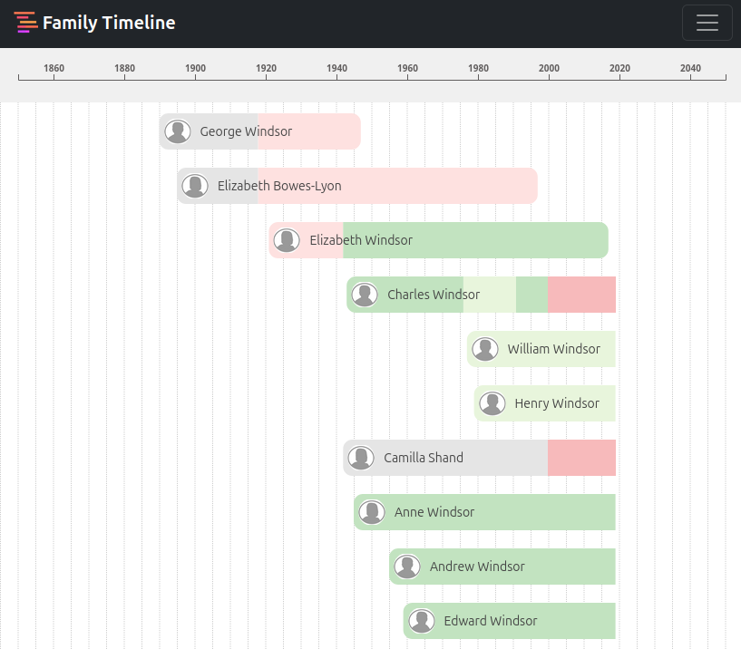

# Family Timeline

<p align="center">
    <h6>Manage your family data with timeline approach.</h6>
    
</p>



Supported languages:
- [x] English
- [x] Français

## Quick start

The recommanded way to start this application is docker compose.

Create a directory of your choice (e.g. ./familytimeline) to hold the docker-compose.yml and .env files.

```bash
mkdir ./familytimeline
cd ./familytimeline
```

Download docker-compose.yml and docker-example.env, either by running the following commands:
And update the .env file with custom values if you want

```bash
wget https://github.com/dmachard/familytimeline/releases/latest/download/docker-compose.yml
wget -O .env https://github.com/dmachard/familytimeline/releases/latest/download/docker-example.env
```

Create data folders

```bash
mkdir -p userdata/ userdata/data userdata/data/profles userdata/data/attachments userdata/data/tmp
cd userdata/
```

Copy default configs

```bash
cp ../backend-server/nginx.conf .
cp ../vuejs-client/public/config.js .
```

Create empty database

```bash
sqlite3 database.sqlite3 < ../backend-server/src/utils/schema.sql
sqlite3 database.sqlite3 < ../backend-server/src/utils/user.sql
```

Start the containers using docker compose command

```bash
docker compose up -d
```

The FamilyTimeline application will be available on `http://localhost:8080/`.
The default user is `admin` with password `admin`.

## Contributing

See the [development guide](./docs/development.md) for more information on how to build it yourself.